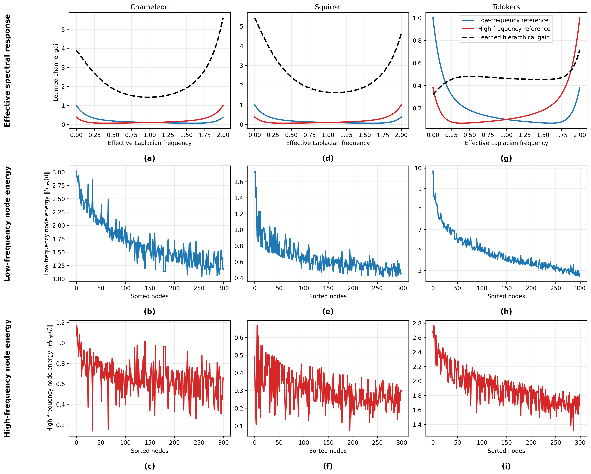

# Filter_Plot

# Effective Spectral Response

## Figure

## Explanation

This figure gives a qualitative spectral interpretation of the proposed hierarchical filter on Chameleon, Squirrel, and Tolokers.

The model applies a learned diagonal operator in a hierarchy-induced orthonormal basis:

`H = U diag(gamma) U^T X`

where:
- `X` is the node feature matrix
- `U = [u_1, ..., u_K]` is the hierarchical basis
- `gamma = [gamma_1, ..., gamma_K]` are the learned channel gains

## Effective Frequency

To connect the learned channels to Laplacian frequency, each basis vector `u_j` is assigned an effective frequency using the Rayleigh quotient:

`lambda_eff(j) = (u_j^T L u_j) / (u_j^T u_j)`

where the normalized graph Laplacian is:

`L = I - D^(-1/2) A D^(-1/2)`

Because the normalized Laplacian has spectrum in `[0, 2]`, the effective frequencies also lie in `[0, 2]`.

## Top Row

The top row plots:
- x-axis: effective Laplacian frequency
- y-axis: learned channel gain

The dashed black curve shows the learned hierarchical gain.
The blue and red curves are idealized low-frequency and high-frequency reference profiles used only for qualitative comparison.

This panel shows whether the learned response behaves more like a low-pass filter, a high-pass filter, or a mixed band-selective filter.

## Low- and High-Frequency Components

The channels are split into low-frequency and high-frequency groups using a threshold `tau`:

- low-frequency set: channels with `lambda_eff(j) <= tau`
- high-frequency set: channels with `lambda_eff(j) > tau`

This gives two filtered responses:

`H_low = U diag(gamma_low) U^T X`

`H_high = U diag(gamma_high) U^T X`

where `gamma_low` keeps only the low-frequency channels and `gamma_high` keeps only the high-frequency channels.

## Node-Wise Energy

The second and third rows show node-wise response energies:

`E_low(i) = ||H_low(i,:)||_2`

`E_high(i) = ||H_high(i,:)||_2`

where `H_low(i,:)` and `H_high(i,:)` are the filtered feature vectors at node `i`.

These panels show how smoother and more oscillatory components are distributed across the graph.

## Interpretation

Overall, the figure shows that although the proposed model is not learned directly in the Laplacian eigenbasis, its channels can still be interpreted relative to Laplacian-defined frequencies through the effective frequency mapping. The top row shows the effective spectral response, while the lower rows show how low- and high-frequency components are distributed across nodes

These panels show how smoother and more oscillatory components are distributed across nodes.
